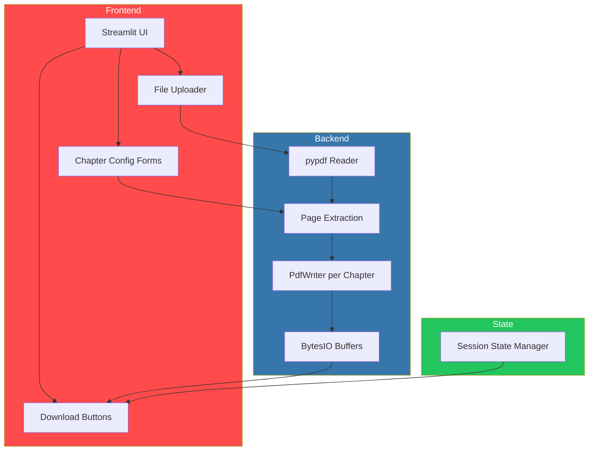

<div align="center">

# 📘 PDF Chapter Splitter Pro

### Split Large PDFs into Clean, Downloadable Chapters — In Seconds

Turn bulky 300–1000 page PDF books into structured, chapter-wise files with a simple, intuitive web interface.

[](https://pdf-splitter-pro.streamlit.app)
[](https://python.org)
[](https://streamlit.io)
[](LICENSE)
[](https://github.com/shah-bakhsh/pdf-splitter-pro/stargazers)

**[🚀 Try Live App](https://pdf-splitter-pro-bveaw3swt4cnu9dnppfntt.streamlit.app/)** · **[🐛 Report Bug](https://github.com/shah-bakhsh/pdf-splitter-pro/issues)** · **[💡 Request Feature](https://github.com/shah-bakhsh/pdf-splitter-pro/issues)**

</div>

---

## 🎯 The Problem

Students, researchers, and professionals deal with **massive PDF books** daily.

Extracting chapters manually is:
- ⏳ **Slow** — hours of copy-paste work
- � **Repetitive** — same tedious process every time
- ❌ **Error-prone** — wrong page ranges, missed content

### The Solution

> **Upload → Define Chapter Ranges → Download Organized PDFs**
>
> What took hours now takes **seconds**.

---

## ✨ Key Features

| Feature | Description |
|---------|-------------|
| 📤 **Smart Upload** | Drag & drop any PDF, auto-detects total pages |
| ✂️ **Multi-Chapter Split** | Split into up to 50 chapters at once |
| ✏️ **Custom Naming** | Name each chapter exactly how you want |
| 📥 **Individual Downloads** | Download each chapter as a clean PDF |
| 💾 **Local Backup** | Auto-saves split files to your machine |
| 🔒 **Secure Processing** | In-memory processing, no data stored on servers |
| ⚡ **Lightning Fast** | Processes 1000+ page PDFs in seconds |
| 🌐 **Zero Installation** | Use directly from your browser |

> **This is not just a script. This is a deployed, production-ready product.**

---

## �️ Live Demo

**Try it instantly — no login, no setup, no installation:**

### 👉 [https://pdf-splitter-pro.streamlit.app](https://pdf-splitter-pro-bveaw3swt4cnu9dnppfntt.streamlit.app/)

---

## ⚙️ How It Works


1. **Upload** your PDF book
2. **View** total number of pages automatically
3. **Define** number of chapters to create
4. **Configure** each chapter — name, start page, end page
5. **Split** with one click
6. **Download** each chapter individually

---

## 🏗️ Architecture



- **Stateless processing** — no files stored permanently
- **In-memory operations** — fast and secure
- **Session state persistence** — downloads survive page reruns

---

## 🛠️ Tech Stack

| Technology | Purpose |
|-----------|---------|
| **Python 3.10+** | Core language |
| **Streamlit** | Web application framework |
| **pypdf** | PDF reading, splitting & writing |
| **Session State** | Persistent download management |

---

## 🚀 Deployment

Deployed on **Streamlit Community Cloud** with zero-config CI/CD:

```
GitHub Push → Auto Build → Live Web App
```

| Platform | Status |
|----------|--------|
| Streamlit Cloud | ✅ Live |
| Local Development | ✅ Supported |

---

## 💻 Run Locally

```bash
# Clone the repository
git clone https://github.com/shah-bakhsh/pdf-splitter-pro.git
cd pdf-splitter-pro

# Install dependencies
pip install -r requirements.txt

# Launch the app
streamlit run app.py
```

Open `http://localhost:8501` in your browser. That's it.

---

## � Project Structure

```
pdf-splitter-pro/
├── app.py              # Main application — UI + splitting logic
├── requirements.txt    # Python dependencies
├── .gitignore          # Git ignore rules
└── README.md           # You are here
```

---

## 🧠 Use Cases

| Audience | Use Case |
|----------|----------|
| 🎓 **Students** | Organize textbooks into chapter PDFs for focused study |
| 👨‍🏫 **Teachers** | Prepare chapter-wise materials for distribution |
| 🔬 **Researchers** | Extract specific sections from lengthy papers |
| 💼 **Professionals** | Split reports, manuals, and documentation |
| 📚 **Book Lovers** | Break down eBooks into manageable sections |

---

## 🔮 Roadmap

- [ ] 🔖 **Bookmark-based** auto chapter detection
- [ ] 🤖 **AI-powered** content segmentation
- [ ] 🔐 **Authentication** system
- [ ] 📊 **Usage tracking** dashboard
- [ ] 💰 **SaaS** subscription model
- [ ] 🌐 **Custom domain** branding
- [ ] 📱 **Mobile-responsive** UI enhancement

---

## 👨‍💻 About the Developer

Built as a **real-world, production-ready tool** demonstrating:

- ✅ Full-stack Python development
- ✅ PDF processing & file manipulation
- ✅ Web application deployment
- ✅ SaaS-ready architecture
- ✅ Clean, professional UI/UX
- ✅ Production deployment pipeline

**Built by [Shah Bakhsh](https://github.com/shah-bakhsh)** 🚀

---

<div align="center">

## ⭐ Support This Project

**If this tool saved you time, show some love:**

[](https://github.com/shah-bakhsh/pdf-splitter-pro)
[](https://github.com/shah-bakhsh/pdf-splitter-pro/fork)
[](https://twitter.com/intent/tweet?text=Check%20out%20PDF%20Chapter%20Splitter%20Pro%20-%20Split%20large%20PDFs%20into%20chapters%20instantly!%20https://github.com/shah-bakhsh/pdf-splitter-pro)

**Every ⭐ motivates me to build more open-source tools!**

---

*Built with ❤️ using Python & Streamlit*

</div>
