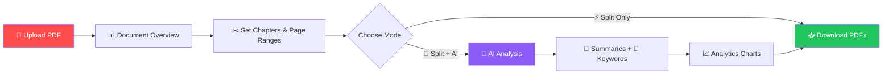
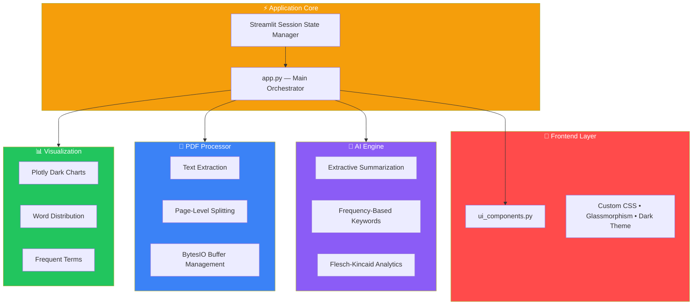

<div align="center">


# PDF Intelligence Platform

### 🚀 AI-Powered Document Analysis & Smart Chapter Splitting

*Split massive PDFs into organized chapters. Get AI summaries, keywords & reading analytics — instantly, from your browser.*

<br>

[](https://pdf-splitter-pro-bveaw3swt4cnu9dnppfntt.streamlit.app/)
&nbsp;&nbsp;
[](https://github.com/shah-bakhsh/pdf-splitter-pro/stargazers)

<br>

[](https://python.org)
[](https://streamlit.io)
[](https://plotly.com)
[](https://scikit-learn.org)
[]()
[](LICENSE)

---

**[🔴 Live Demo](https://pdf-splitter-pro-bveaw3swt4cnu9dnppfntt.streamlit.app/)** · **[📖 Docs](#-how-it-works)** · **[🏗️ Architecture](#-architecture)** · **[🐛 Report Bug](https://github.com/shah-bakhsh/pdf-splitter-pro/issues)** · **[💡 Request Feature](https://github.com/shah-bakhsh/pdf-splitter-pro/issues)**

</div>

---

<br>

## 💡 The Problem

> *You have a 500-page PDF textbook. You need Chapter 7. What do you do?*

| ❌ Without This Tool | ✅ With PDF Intelligence Platform |
|---|---|
| Scroll through 500 pages manually | Upload → Set chapters → Download in seconds |
| Screenshot pages one by one | Get clean, split PDFs with one click |
| Use sketchy online tools that steal your data | 100% in-memory — **your files never leave your machine** |
| No idea what's in each section | AI tells you: summary, keywords, reading time |

<br>

---

## ✨ Features

<table>
<tr>
<td width="50%">

### 🧠 AI-Powered Intelligence
- **📝 Smart Summaries** — Extractive AI summarization per chapter
- **🔑 Keyword Extraction** — Top terms using frequency analysis
- **📊 Reading Analytics** — Flesch-Kincaid difficulty, word count, reading time
- **📈 Interactive Charts** — Plotly word distribution & frequent terms

</td>
<td width="50%">

### ⚡ Power & Flexibility
- **✂️ Precision Splitting** — You control chapter count & page ranges
- **⚡ Two Modes** — "Split Only" (instant) or "Split + AI" (with insights)
- **📥 Multi-Format Export** — Individual PDFs, ZIP bundle, AI report (.md)
- **🔒 Privacy First** — Zero data stored, everything processed in-memory

</td>
</tr>
<tr>
<td width="50%">

### 🎨 Premium Experience
- **🌙 Dark SaaS UI** — Glassmorphism cards, gradient hero, Inter font
- **📱 Responsive** — Works on desktop, tablet, and mobile
- **⏱️ Real-Time Progress** — Live progress bar during AI analysis
- **🔄 Session Persistence** — Results stay until you reset

</td>
<td width="50%">

### 🏗️ Production Grade
- **📦 Modular Architecture** — 5 clean, separated Python modules
- **☁️ Cloud Deployed** — Live on Streamlit Cloud with CI/CD
- **🧪 Error Handling** — Graceful fallbacks for corrupted/empty PDFs
- **📋 Clean Code** — PEP8, docstrings, type hints throughout

</td>
</tr>
</table>

<br>

---

## 🚀 Live Demo

### 👉 **[Open the App →](https://pdf-splitter-pro-bveaw3swt4cnu9dnppfntt.streamlit.app/)**

> The app is **deployed and running** on Streamlit Cloud — no installation needed. Just open the link and start splitting PDFs!

<br>

---

## 🎬 How It Works



<br>

### Step-by-Step

| Step | Action | What Happens |
|:---:|--------|-------------|
| **1** | 📤 **Upload PDF** | Drag & drop any PDF (books, reports, papers — up to 200MB) |
| **2** | 📊 **Review Overview** | See total pages, words, reading difficulty, estimated reading time |
| **3** | ✂️ **Define Chapters** | Set how many chapters + exact page ranges (auto-calculated defaults) |
| **4** | ⚡ **Choose Mode** | "Split Only" for speed, or "Split + AI" for full intelligence |
| **5** | 📥 **Download** | Get individual PDFs, full ZIP bundle, or AI analysis report |

<br>

---

## 🏗️ Architecture



<br>

### 📁 Project Structure

```
pdf-splitter-pro/
│
├── 📘 app.py                 Main Streamlit application — orchestrates all modules
├── 📄 pdf_processor.py       PDF text extraction, page splitting, buffer management
├── 🧠 ai_engine.py           AI summaries, keyword extraction, reading statistics
├── 📊 analytics.py           Plotly chart generation (word distribution, terms)
├── 🎨 ui_components.py       Premium UI — custom CSS, hero, cards, badges
├── 📋 requirements.txt       Python dependencies
├── 📝 README.md              This file
└── 🚫 .gitignore             Git ignore rules
```

<br>

---

## 🛠️ Tech Stack

| Layer | Technology | Purpose |
|:-----:|-----------|---------|
| 🐍 | **Python 3.13** | Core programming language |
| 🌐 | **Streamlit** | Web framework + cloud deployment |
| 📄 | **pypdf** | PDF reading, writing, and manipulation |
| 📊 | **Plotly** | Interactive dark-themed data visualizations |
| 🤖 | **scikit-learn** | TF-IDF vectorization for NLP features |
| ☁️ | **Streamlit Cloud** | Production hosting with GitHub CI/CD |

> **💡 Design Decision:** No heavy AI models (no GPT, no LLMs, no spaCy). The platform uses **efficient extractive algorithms** — making it fast, lightweight, and deployable on free-tier cloud services.

<br>

---

## 💻 Run Locally

```bash
# 1. Clone the repo
git clone https://github.com/shah-bakhsh/pdf-splitter-pro.git
cd pdf-splitter-pro

# 2. Install dependencies
pip install -r requirements.txt

# 3. Launch the app
streamlit run app.py
```

> Opens at `http://localhost:8501` ✨

<br>

---

## 🧠 AI Features Deep Dive

### 📝 Extractive Summarization
Sentences are scored using **word frequency analysis** with position boosting. The algorithm extracts the most information-dense sentences while preserving original order — no hallucination, just the author's own words.

### 🔑 Keyword Extraction
Uses **frequency analysis with stopword filtering** to surface the most significant terms in each chapter. Supports 60+ stopwords including academic-specific terms (chapter, figure, table, section).

### 📊 Reading Difficulty
Implements the **Flesch-Kincaid Reading Ease** formula:
- 🟢 **70+** = Easy (conversational)
- 🟡 **50–70** = Standard (general audience)
- 🟠 **30–50** = Moderate (college level)
- 🔴 **< 30** = Advanced (academic/technical)

### ⏱️ Reading Time
Calculated at **250 words per minute** — the average adult reading speed for non-fiction content.

<br>

---

## 🧑‍💼 Use Cases

| Audience | Use Case |
|----------|----------|
| 🎓 **Students** | Split textbooks into chapter PDFs for focused semester study |
| 👩‍🏫 **Educators** | Prepare chapter-wise materials for classroom distribution |
| 🔬 **Researchers** | Extract specific sections from 200+ page academic papers |
| 💼 **Professionals** | Split contracts, reports, and manuals by section |
| 📚 **Book Lovers** | Organize large eBooks into comfortable reading chunks |
| 📰 **Content Creators** | Analyze document structure, extract key themes |

<br>

---

## 👨‍💻 Skills Demonstrated

> *This project serves as a comprehensive portfolio piece showcasing professional-grade engineering.*

| Competency | Evidence |
|-----------|----------|
| **Full-Stack Python** | Modular 5-file architecture, clean separation of concerns |
| **NLP & AI Engineering** | Extractive summarization, frequency analysis, Flesch-Kincaid metrics |
| **Data Visualization** | Interactive Plotly charts with dark theme and responsive layouts |
| **Web App Development** | Streamlit framework with custom CSS, session state management |
| **UI/UX Design** | SaaS-quality dark theme, glassmorphism, gradient hero, Inter typography |
| **Cloud Deployment** | CI/CD pipeline via GitHub → Streamlit Cloud |
| **PDF Engineering** | In-memory BytesIO processing, zero disk I/O, efficient page-level splitting |
| **Production Practices** | Error handling, graceful degradation, input validation, clean code |

<br>

---

## 🔮 Future Roadmap

| Priority | Feature | Status |
|:--------:|---------|:------:|
| 🔥 | Bookmark-based auto chapter detection | Planned |
| 🔥 | LLM-powered intelligent summaries (Gemini/GPT) | Planned |
| ⭐ | Multi-language document support | Planned |
| ⭐ | PDF merge (combine multiple PDFs) | Planned |
| 💎 | User authentication & history | Planned |
| 💎 | API endpoint for programmatic access | Planned |

<br>

---

<div align="center">

## ⭐ Support This Project

If this tool saved you time, consider starring the repo!

[](https://github.com/shah-bakhsh/pdf-splitter-pro)
&nbsp;
[](https://github.com/shah-bakhsh/pdf-splitter-pro/fork)
&nbsp;
[](https://twitter.com/intent/tweet?text=Check%20out%20PDF%20Intelligence%20Platform%20—%20AI-powered%20PDF%20splitting%20with%20summaries%20%26%20analytics!%20🚀%20https://pdf-splitter-pro-bveaw3swt4cnu9dnppfntt.streamlit.app/)

<br>

**Every ⭐ helps others discover this tool and motivates building more open-source projects!**

---

<br>

**Built with ❤️ by [Shah Bakhsh](https://github.com/shah-bakhsh)**

*Python • Streamlit • AI/NLP • Plotly • Open Source*

<br>

[](https://pdf-splitter-pro-bveaw3swt4cnu9dnppfntt.streamlit.app/)

</div>
