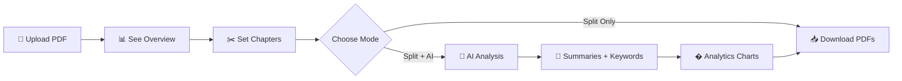
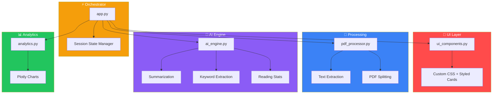

<div align="center">

# 📘 PDF Intelligence Platform

### AI-Powered Document Analysis & Smart Chapter Splitting

Transform massive PDFs into organized, chapter-wise files with built-in AI summaries, keyword extraction, and reading analytics — all from your browser.

[](https://pdf-splitter-pro.streamlit.app)
[](https://python.org)
[](https://streamlit.io)
[](LICENSE)
[](https://github.com/shah-bakhsh/pdf-splitter-pro/stargazers)

**[🚀 Try Live](https://pdf-splitter-pro.streamlit.app)** · **[🐛 Report Bug](https://github.com/shah-bakhsh/pdf-splitter-pro/issues)** · **[💡 Request Feature](https://github.com/shah-bakhsh/pdf-splitter-pro/issues)**

</div>

---

## 🎯 The Problem

You have a **500-page PDF textbook**. You need Chapter 7.

Your options:
- ❌ Scroll endlessly
- ❌ Screenshot pages one by one
- ❌ Use a sketchy online tool that uploads your data to unknown servers

### ✅ The Solution

> **Upload → Set Chapter Ranges → Download Clean PDFs**
>
> Plus AI-powered summaries, keywords, and analytics. All processed **in-memory** — your data never leaves your machine.

---

## ✨ Features at a Glance

| Feature | Description |
|---------|-------------|
| ✂️ **Smart PDF Splitting** | Split any PDF into custom chapters with exact page ranges |
| 📝 **AI Summaries** | Auto-generated extractive summaries for each chapter |
| 🔑 **Keyword Extraction** | Top keywords per chapter using frequency analysis |
| � **Reading Analytics** | Word count, reading difficulty (Flesch-Kincaid), estimated reading time |
| � **Interactive Charts** | Plotly-powered word distribution and frequent terms visualizations |
| � **Flexible Downloads** | Individual PDFs, ZIP bundle, or AI analysis report |
| ⚡ **Two Modes** | "Split Only" (instant) or "Split + AI Analysis" (with insights) |
| 🔒 **Privacy First** | Everything processed in-memory — zero data stored on any server |
| 🎨 **Premium UI** | Dark-themed SaaS-quality interface with custom styling |

---

## ⚡ Two Action Modes

<table>
<tr>
<td width="50%" align="center">

### ✂️ Split Only
**Instant** — just split, no AI

Perfect when you know exactly what chapters you want and need them fast.

</td>
<td width="50%" align="center">

### � Split + AI Analysis
**Smart** — split with full insights

Get summaries, keywords, reading stats, and analytics charts for each chapter.

</td>
</tr>
</table>

---

## 🖥️ How It Works



1. **Upload** your PDF — supports books, reports, papers up to 200MB
2. **Review** document overview — pages, words, reading difficulty, time
3. **Set** number of chapters — page ranges auto-calculated evenly
4. **Adjust** names and page ranges to your needs
5. **Choose** Split Only (fast) or Split + AI (with insights)
6. **Download** individual PDFs, ZIP bundle, or AI report

---

## 🏗️ Architecture



| Module | Purpose |
|--------|---------|
| `app.py` | Main orchestrator — routes data between all modules |
| `pdf_processor.py` | PDF reading, text extraction, page-level splitting |
| `ai_engine.py` | Summaries, keywords, reading stats — pure Python, no heavy models |
| `analytics.py` | Plotly charts — word distribution, frequent terms |
| `ui_components.py` | Premium CSS, hero header, metric cards, chapter cards |

---

## 🛠️ Tech Stack

| Technology | Role | Why |
|-----------|------|-----|
| **Python 3.10+** | Core language | Modern, readable, powerful |
| **Streamlit** | Web framework | Rapid UI development, free cloud hosting |
| **pypdf** | PDF engine | Fast, pure-Python PDF manipulation |
| **Plotly** | Charts | Interactive, dark-mode compatible visualizations |
| **scikit-learn** | NLP toolkit | TF-IDF vectorization for keyword extraction |

> **Design Decision:** No heavy AI models (no GPT, no spaCy). The platform uses efficient extractive algorithms for speed and lightweight deployment.

---

## 🚀 Deploy on Streamlit Cloud

```
GitHub Push → Auto Build → Live Web App (Free!)
```

1. Fork this repo
2. Go to [share.streamlit.io](https://share.streamlit.io)
3. Connect your GitHub → Select `pdf-splitter-pro` → Main file: `app.py`
4. Click **Deploy** 🚀

---

## 💻 Run Locally

```bash
# Clone
git clone https://github.com/shah-bakhsh/pdf-splitter-pro.git
cd pdf-splitter-pro

# Install
pip install -r requirements.txt

# Launch
streamlit run app.py
```

Opens at `http://localhost:8501` — that's it.

---

## 📁 Project Structure

```
pdf-splitter-pro/
├── app.py                # Main Streamlit app — orchestrates everything
├── pdf_processor.py      # PDF text extraction & splitting engine
├── ai_engine.py          # AI summaries, keywords, reading stats
├── analytics.py          # Plotly chart generators
├── ui_components.py      # Premium UI components & CSS
├── requirements.txt      # Python dependencies
├── .gitignore
└── README.md
```

---

## 🧠 Use Cases

| Who | Use Case |
|-----|----------|
| 🎓 **Students** | Split textbooks into chapter PDFs for focused study |
| �‍🏫 **Teachers** | Prepare chapter-wise materials for distribution |
| 🔬 **Researchers** | Extract sections from lengthy academic papers |
| 💼 **Professionals** | Split reports, contracts, and manuals |
| 📚 **Book Lovers** | Organize eBooks into readable chunks |

---

## 🔮 Roadmap

- [ ] 🔖 Bookmark-based automatic chapter detection
- [ ] 🤖 LLM-powered intelligent summaries
- [ ] 📱 Mobile-responsive UI
- [ ] 🌐 Multi-language document support
- [ ] 🔐 Authentication & user accounts
- [ ] 📊 Usage analytics dashboard
- [ ] 💰 SaaS subscription model

---

## 👨‍💻 About the Developer

This project demonstrates production-level skills in:

| Skill | Implementation |
|-------|---------------|
| **Full-Stack Python** | Modular architecture, clean code, session management |
| **NLP & AI** | Extractive summarization, TF-IDF analysis, reading metrics |
| **Data Visualization** | Interactive Plotly charts with dark theme |
| **Web Development** | Custom CSS, responsive UI, SaaS-quality design |
| **Cloud Deployment** | Streamlit Cloud CI/CD pipeline |
| **PDF Engineering** | In-memory processing, efficient byte buffer management |

**Built by [Shah Bakhsh](https://github.com/shah-bakhsh)** 🚀

---

<div align="center">

## ⭐ Like This Project?

[](https://github.com/shah-bakhsh/pdf-splitter-pro)
[](https://github.com/shah-bakhsh/pdf-splitter-pro/fork)
[](https://twitter.com/intent/tweet?text=Check%20out%20this%20AI-powered%20PDF%20Intelligence%20Platform!%20Split%20PDFs,%20get%20AI%20summaries%20%26%20analytics%20🚀%20https://github.com/shah-bakhsh/pdf-splitter-pro)

**Every ⭐ motivates building more open-source tools!**

---

*Built with ❤️ using Python, Streamlit & AI*

</div>
